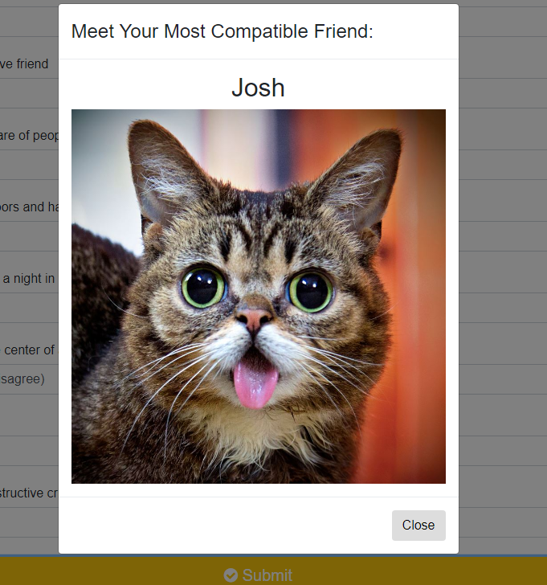

# Friend Finder

Friend Finder is a compatibility-based application -- similar to a dating app. This full-stack site will take in results from users' surveys, then compare their answers with those from other users. The app will then display the name and picture of the user with the best overall match.

### Home Page


### Modal 



## Demo

Friend Finder is hosted on Heroku. Check it out by [clicking here](https://fernanda-friend-finder.herokuapp.com/).

## Getting Started

To start using Friend Finder locally, use localhost:8080 after following these steps:

``` js
git clone git@github.com:fernandamarr/friend-finder.git
cd friend-finder
npm install
```

## Technologies Used

* HTML
* CSS/Bootstrap
* Google Fonts
* JavaScript
* jQuery
* AJAX
* Node.js
* Express
* NPM Modules:
  * Express
  * Path